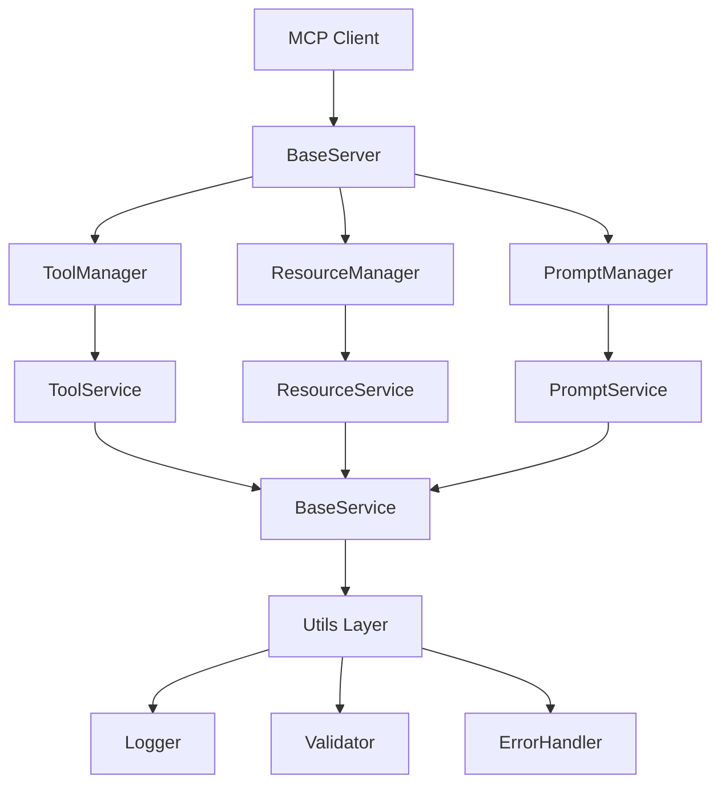

# MCP 서버 보일러플레이트 핵심 컴포넌트 설계

## 🏗️ 아키텍처 개요



## 🎯 1. BaseServer (핵심 서버 클래스)

### 인터페이스 정의

```typescript
interface IServerConfig {
  name: string;
  version: string;
  capabilities?: {
    tools?: {};
    resources?: {};
    prompts?: {};
    sampling?: {};
  };
  transport?: "stdio" | "http";
  port?: number;
}

abstract class BaseServer {
  protected config: IServerConfig;
  protected server: Server;
  protected toolManager: ToolManager;
  protected resourceManager: ResourceManager;
  protected promptManager: PromptManager;
  protected isInitialized: boolean = false;
  protected isRunning: boolean = false;

  constructor(config: IServerConfig);

  // 추상 메서드 - 구현체에서 반드시 구현
  abstract registerServices(): Promise<void>;
  abstract setupCustomHandlers(): Promise<void>;

  // 공통 메서드
  async initialize(): Promise<void>;
  async run(): Promise<void>;
  async shutdown(): Promise<void>;

  // 보호된 메서드
  protected setupBaseHandlers(): void;
  protected setupErrorHandling(): void;
  protected setupGracefulShutdown(): void;
}
```

### 구현 세부사항

```typescript
// 초기화 순서
1. 설정 검증
2. MCP Server 인스턴스 생성
3. 매니저들 초기화
4. 서비스 등록 (추상 메서드)
5. 핸들러 설정
6. 에러 처리 설정
```

## 🔧 2. Manager 패턴 (툴/리소스/프롬프트 관리)

### 공통 인터페이스

```typescript
interface IManager<TItem, TConfig> {
  // 등록/해제
  register(name: string, config: TConfig): void;
  unregister(name: string): boolean;

  // 조회
  list(): TItem[];
  get(name: string): TItem | undefined;
  exists(name: string): boolean;

  // 실행
  execute(name: string, params: any): Promise<any>;

  // 생명주기
  initialize(): Promise<void>;
  cleanup(): Promise<void>;
}
```

### ToolManager 구현

```typescript
interface ToolConfig {
  name: string;
  description: string;
  inputSchema: z.ZodSchema;
  handler: (params: any) => Promise<ToolResult>;
  service?: string; // 연결된 서비스 이름
}

class ToolManager implements IManager<Tool, ToolConfig> {
  private tools: Map<string, Tool> = new Map();
  private services: Map<string, BaseService> = new Map();

  async register(name: string, config: ToolConfig): Promise<void> {
    // 1. 스키마 검증
    // 2. 중복 확인
    // 3. 서비스 연결 (있는 경우)
    // 4. 툴 등록
  }

  async execute(name: string, params: any): Promise<ToolResult> {
    // 1. 툴 존재 확인
    // 2. 파라미터 검증
    // 3. 서비스 호출 또는 직접 실행
    // 4. 결과 반환
  }

  // MCP 프로토콜 호환 메서드
  async listTools(): Promise<ListToolsResult> {
    return {
      tools: Array.from(this.tools.values()).map((tool) => ({
        name: tool.name,
        description: tool.description,
        inputSchema: tool.inputSchema,
      })),
    };
  }
}
```

### ResourceManager 구현

```typescript
interface ResourceConfig {
  name: string;
  uri: string | ResourceTemplate;
  description?: string;
  mimeType?: string;
  handler: (uri: URL, params?: any) => Promise<ResourceResult>;
  service?: string;
}

class ResourceManager implements IManager<Resource, ResourceConfig> {
  private resources: Map<string, Resource> = new Map();
  private templates: Map<string, ResourceTemplate> = new Map();

  async register(name: string, config: ResourceConfig): Promise<void> {
    // 1. URI 패턴 검증
    // 2. 템플릿 처리 (동적 리소스인 경우)
    // 3. 핸들러 검증
    // 4. 리소스 등록
  }

  async execute(uri: string, params?: any): Promise<ResourceResult> {
    // 1. URI 매칭
    // 2. 템플릿 파라미터 추출 (동적 리소스인 경우)
    // 3. 핸들러 실행
    // 4. 결과 반환
  }

  // MCP 프로토콜 호환 메서드
  async listResources(): Promise<ListResourcesResult> {
    return {
      resources: Array.from(this.resources.values()).map((resource) => ({
        uri: resource.uri,
        name: resource.name,
        description: resource.description,
        mimeType: resource.mimeType,
      })),
    };
  }
}
```

### PromptManager 구현

```typescript
interface PromptConfig {
  name: string;
  description?: string;
  arguments?: z.ZodSchema;
  handler: (params: any) => Promise<PromptResult>;
  service?: string;
}

class PromptManager implements IManager<Prompt, PromptConfig> {
  private prompts: Map<string, Prompt> = new Map();

  async execute(name: string, params: any): Promise<PromptResult> {
    // 1. 프롬프트 존재 확인
    // 2. 인자 검증
    // 3. 핸들러 실행
    // 4. 메시지 배열 반환
  }

  // MCP 프로토콜 호환 메서드
  async listPrompts(): Promise<ListPromptsResult> {
    return {
      prompts: Array.from(this.prompts.values()).map((prompt) => ({
        name: prompt.name,
        description: prompt.description,
        arguments: prompt.arguments,
      })),
    };
  }
}
```

## 🏢 3. Service 패턴 (비즈니스 로직)

### BaseService 추상 클래스

```typescript
abstract class BaseService {
  protected name: string;
  protected config: any;
  protected isInitialized: boolean = false;

  constructor(name: string, config?: any) {
    this.name = name;
    this.config = config || {};
  }

  // 추상 메서드
  abstract initialize(): Promise<void>;
  abstract cleanup(): Promise<void>;

  // 공통 메서드
  getName(): string {
    return this.name;
  }
  isReady(): boolean {
    return this.isInitialized;
  }

  // 보호된 메서드
  protected validateConfig(): void {
    // 설정 검증 로직
  }

  protected log(level: string, message: string, meta?: any): void {
    // 로깅 로직
  }
}
```

### ExampleService 구현

```typescript
class ExampleService extends BaseService {
  private data: Map<string, any> = new Map();

  constructor(config?: any) {
    super("example", config);
  }

  async initialize(): Promise<void> {
    this.validateConfig();
    // 초기화 로직 (DB 연결, 외부 API 설정 등)
    this.isInitialized = true;
    this.log("info", "ExampleService initialized");
  }

  async cleanup(): Promise<void> {
    // 정리 로직 (연결 해제, 리소스 정리 등)
    this.data.clear();
    this.isInitialized = false;
    this.log("info", "ExampleService cleaned up");
  }

  // 비즈니스 메서드들
  async getData(key: string): Promise<any> {
    if (!this.isInitialized) {
      throw new Error("Service not initialized");
    }
    return this.data.get(key);
  }

  async setData(key: string, value: any): Promise<void> {
    if (!this.isInitialized) {
      throw new Error("Service not initialized");
    }
    this.data.set(key, value);
  }
}
```

## 🛠️ 4. Utils Layer (유틸리티)

### Logger

```typescript
interface LogLevel {
  ERROR: "error";
  WARN: "warn";
  INFO: "info";
  DEBUG: "debug";
}

class Logger {
  private static instance: Logger;
  private isDevelopment: boolean;

  private constructor() {
    this.isDevelopment = process.env.NODE_ENV !== "production";

    // 개발 환경에서 mcps-logger 활성화
    if (this.isDevelopment) {
      import("mcps-logger/console").catch(() => {
        // mcps-logger가 없는 경우 무시
      });
    }
  }

  static getInstance(): Logger {
    if (!Logger.instance) {
      Logger.instance = new Logger();
    }
    return Logger.instance;
  }

  log(level: keyof LogLevel, message: string, meta?: any): void {
    if (this.isDevelopment) {
      console[level](`[${level.toUpperCase()}] ${message}`, meta || "");
    } else {
      // 프로덕션에서는 stderr만 사용 (MCP 호환성)
      if (level === "error") {
        console.error(`[ERROR] ${message}`, meta || "");
      }
    }
  }

  error(message: string, meta?: any): void {
    this.log("error", message, meta);
  }
  warn(message: string, meta?: any): void {
    this.log("warn", message, meta);
  }
  info(message: string, meta?: any): void {
    this.log("info", message, meta);
  }
  debug(message: string, meta?: any): void {
    this.log("debug", message, meta);
  }
}
```

### Validator

```typescript
class Validator {
  static validateSchema<T>(data: unknown, schema: z.ZodSchema<T>): T {
    try {
      return schema.parse(data);
    } catch (error) {
      if (error instanceof z.ZodError) {
        throw new McpError(
          ErrorCode.InvalidParams,
          `Validation failed: ${error.errors.map((e) => e.message).join(", ")}`
        );
      }
      throw error;
    }
  }

  static validateRequired(value: any, fieldName: string): void {
    if (value === undefined || value === null) {
      throw new McpError(
        ErrorCode.InvalidParams,
        `Required field '${fieldName}' is missing`
      );
    }
  }

  static validateString(value: any, fieldName: string): string {
    if (typeof value !== "string") {
      throw new McpError(
        ErrorCode.InvalidParams,
        `Field '${fieldName}' must be a string`
      );
    }
    return value;
  }
}
```

### ErrorHandler

```typescript
class ErrorHandler {
  static handleToolError(error: unknown, toolName: string): never {
    const logger = Logger.getInstance();

    if (error instanceof McpError) {
      logger.error(`Tool '${toolName}' failed:`, error.message);
      throw error;
    }

    if (error instanceof Error) {
      logger.error(`Tool '${toolName}' failed:`, error.message);
      throw new McpError(
        ErrorCode.InternalError,
        `Tool execution failed: ${error.message}`
      );
    }

    logger.error(`Tool '${toolName}' failed with unknown error:`, error);
    throw new McpError(
      ErrorCode.InternalError,
      "Tool execution failed with unknown error"
    );
  }

  static handleResourceError(error: unknown, uri: string): never {
    const logger = Logger.getInstance();

    if (error instanceof McpError) {
      logger.error(`Resource '${uri}' failed:`, error.message);
      throw error;
    }

    if (error instanceof Error) {
      logger.error(`Resource '${uri}' failed:`, error.message);
      throw new McpError(
        ErrorCode.InternalError,
        `Resource access failed: ${error.message}`
      );
    }

    logger.error(`Resource '${uri}' failed with unknown error:`, error);
    throw new McpError(
      ErrorCode.InternalError,
      "Resource access failed with unknown error"
    );
  }
}
```

## 🔄 5. 생명주기 관리

### LifecycleManager

```typescript
class LifecycleManager {
  private phases: Map<string, LifecyclePhase> = new Map();
  private currentPhase: string = "stopped";

  registerPhase(name: string, phase: LifecyclePhase): void {
    this.phases.set(name, phase);
  }

  async transition(to: string): Promise<void> {
    const phase = this.phases.get(to);
    if (!phase) {
      throw new Error(`Unknown lifecycle phase: ${to}`);
    }

    await phase.enter(this.currentPhase);
    this.currentPhase = to;
  }

  getCurrentPhase(): string {
    return this.currentPhase;
  }
}

interface LifecyclePhase {
  enter(from: string): Promise<void>;
  exit(to: string): Promise<void>;
}
```

## 📋 다음 단계

1. **구현 계획 수립** → `04-implementation-plan.md`
2. **프로젝트 폴더 생성** → `mcp-server-boilerplate/`
3. **핵심 파일들 구현** → 타입 정의부터 시작
4. **예제 구현** → 동작하는 예제 생성
5. **테스트 및 문서화** → 완성도 검증
